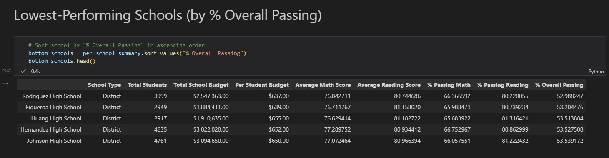
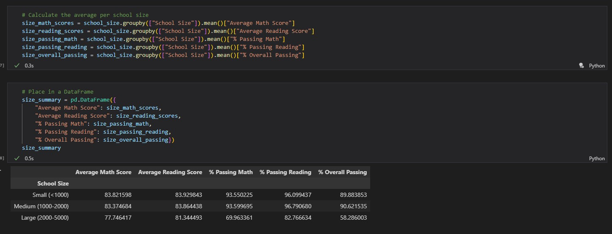

# pandas-challenge

This project is an assignment submission for the University of Minnesota Data Analytics and Visualization Boot Camp.

## Purpose

You are the new Chief Data Scientist for your city's school district. In this capacity, you'll be helping the school board and mayor make strategic decisions regarding future school budgets and priorities.

As a first task, you've been asked to analyze the district-wide standardized test results. You'll be given access to every student's math and reading scores, as well as various information on the schools they attend. Your task is to aggregate the data to showcase obvious trends in school performance.

This analysis will use Python and Pandas inside of Jupyter Notebook. These tasks are being performed using VSCode.

## Process

Before beginning processing, the correct dependencies and files must be imported and read. Since there are two csv files involved in this analysis, those csv files must also be merged into a single DataFrame.

### District Summary

The first step in processing the data for analysis is to create a District Summary DataFrame. In order to do this, the following calculations need to be performed:
- Total number of unique schools
- Total students
- Total budget
- Average math score
- Average reading score
- % passing math (the percentage of students who passed math)
- % passing reading (the percentage of students who passed reading)
- % overall passing (the percentage of students who passed math AND reading)

### School Summary

Next, a DataFrame must be created to show budgets, average scores, and passing rate percentages for each school in the district. This DataFrame will include the following information, so calculations must be performed to find some of these pieces of data:
- School name
- School type
- Total students
- Total school budget
- Per student budget
- Average math score
- Average reading score
- % passing math (the percentage of students who passed math)
- % passing reading (the percentage of students who passed reading)
- % overall passing (the percentage of students who passed math AND reading)

### Highest-Performing and Lowest-Performing Schools (by % Overall Passing)

Sorting the School Summary DataFrame will allow us to see the highest-performing schools and the lowest-performing schools by their overall passing percentages.

### Scores by Grade

In order to check for any trends across grades for each of the schools in the district, two other DataFrame must be created, one for average math scores and one for average reading scores, each separated by grade.

### Scores by School Spending

Since every school has a different budget, in order to look for trends based on spending, the schools need to be separated into categories based on spending. For this purpose, the schools can be separated into four groups based on their per-student budgets (<$585, $585-$630, $630-$645, and $645-$680). Once the schools are placed into categories, we find the averages per spending range, and then we can look at the cateogires as a whole for specific trends in score outcomes based on per-student spending.

### Scores by School Size

In the same way as the previous split, the Per_Student_Summary DataFrame can be split into categories of school size.

### Scores by School Type

The district has both Charter schools and District schools. In order to see if one type of school is performing better than the other, a new DataFrame must be created to show the average scores by school type.

## Analysis Summary

- Charter schools performed better than District schools throughout the district, showing a 35% difference in average math scores and 20% difference in reading scores between them. Charter schools are typically smaller than District schools and tend to have different teaching methods, so it would be worth considering these differences when comparing their results versus those of District schools.

- Increased spending per student does not yield better results in test scores. Instead, the opposite is true. The schools with the lowest per-student budgets are Charter schools with small to medium school sizes, resulting in less students failing overall, increases the schools' averages.

- Many schools' averages are being brought down by a substantial amount of students failing math. Differences in math averages are vastly different (from 65% to 95%), whereas reading averages are quite comparable throughout the district.
